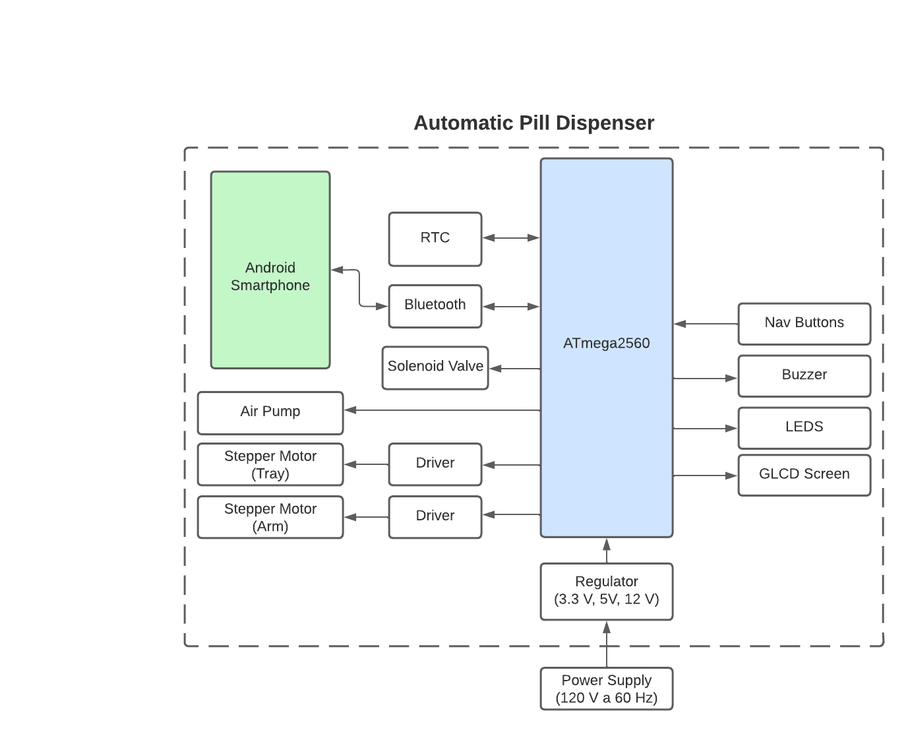

# Automatic Pill dispenser

Automatic pill dispenser of tablets and capsules, aimed for people who stay most of the time at home. It can be synchronized with an Android smartphone via Bluetooth using our application.

**Note**: To see more detailed documentation, go to ./Documentation/

## Main Features

The automatic pill dispenser is built using an embedded system based on the AVR ATmega2560, using a combination of motors, electronic modules and recipients to store the pills.

### Notification system

- When a dose is dispensed, the system will notify the user in different ways:
  - Play a melody
  - A LED will turn on
  - The LCD screen shows a message
- When there are no pills left in a container, the user gets notified

Smart dispenser for solid oral medication (tablets and capsules), for people who are mainly at home. It will be able to be synchronized with a smartphone via an app.

### Containers for four different pill types

- One container for each type of pill
- Holds at least 30 pills on average
- The dispenser picks pills one by one with a pneumatic suction system

### Notification system

- When a dose is ready it notifies in the following ways
  - Plays a sound
  - Lights an LED
  - Notifies via the application
  - Notification via e-mail

#### Notification when there are few pills left

- By means of a count per container
- Notification when a container is low on pills

#### Notification when a container runs out of pills

- If after a certain number of pills
- Display message on screen
- Send notification to smartphone

#### Notification of missed doses

- If the tray was not detected to be removed within a certain time (**1 hour max.**)
- Notify by tray LED indicator
- Notify by sound and application every 15 min (4 times in total)

### Automatic dispensing based on user configuration

- Directly programmable on the dispenser
- Programmable via an Android app
- Varying number of pills to be dispensed
- User-selectable time interval
- Selectable days

#### Pill counter

- Via a sensor that is activated when a pill is dropped
- Internal counting by pill type
  - Notifying when the pills in the container are finished
  - Synchronization for detailed application logging

### Sensor to detect if pills have been taken

- By a switch to detect when the tray has been withdrawn

### LED indicator for tray

- When pills are available to be taken, a green LED lights up.
- If the dose has not been taken, the LED changes to red.

### Charging with 120 VAC at 60 Hz

- To be connected directly to the electrical plug.
- Use a step down converter to bring down the voltage to a safe level to be used by the embedded system.

### Battery in case of power loss*

- To be activated when main power source is disconnected.
- On return of power, start charging the battery again.

*\* Planned features*

-------------------------------------------------------------------------------

## Key features of the app

The system can be configured more quickly and easily using a smartphone with our application.

**Note:** Made for *Android* devices. Requires working Bluetooth connectivity.

### Connectivity

- Wireless connectivity to the dispenser via Bluetooth
- Enables data synchronization
- Quick and easy setup

### Notification and reminders on smartphone

- Send a notification according to the type of event
- Allow to postpone notification (15 min)
- Alert by sound

### Detailed record of pills taken

Keep track of pills by synchronizing data with the dispenser and show statistics.

Includes:

- Which pills were taken
- How many pills
- What time taken (with the help of the tray detector)
- What day taken
- Missed doses
